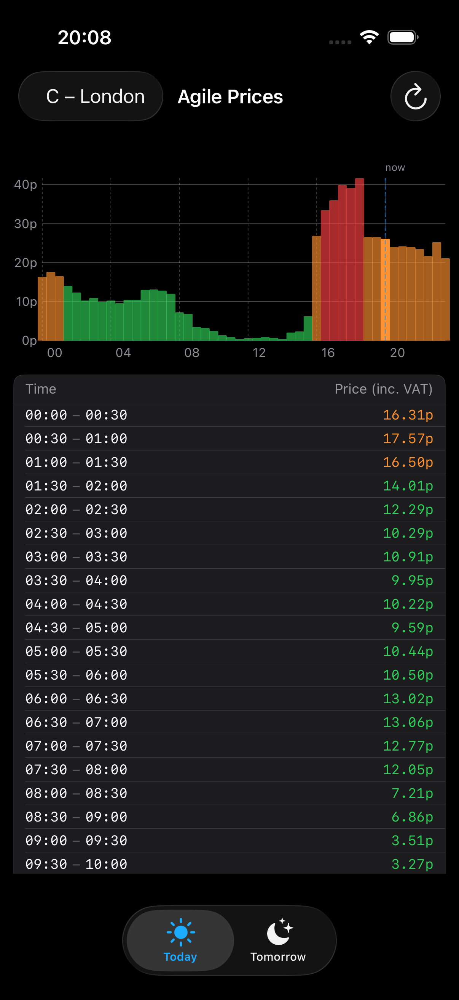
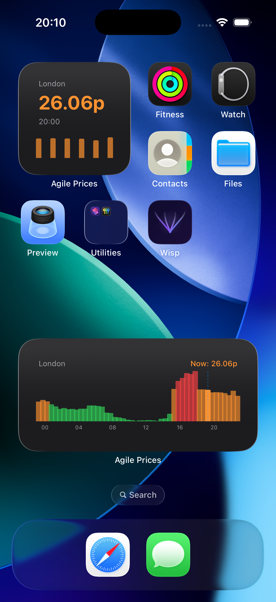

# Octopus Agile Prices

A macOS menubar app and iOS app that shows [Octopus Energy Agile](https://octopus.energy/agile/) half-hourly electricity prices as a bar chart, plus a 7-day price forecast. Includes iOS home screen widgets.

## macOS

## iOS

## Widget

## Features

- Bar chart of today's and tomorrow's 30-minute price slots
- Colour-coded by price: green (<15p), amber (<30p), red (≥30p), blue (negative)
- Current time slot highlighted with a "now" marker
- Tooltips showing the price and time for each bar (hover on macOS, tap-and-drag on iOS)
- Price table listing all 48 slots
- 7-day tab with predicted prices: a line coloured by the same price bands, the p10–p90 uncertainty band shaded behind it, and a per-day table of the cheapest slot, daily average and peak
- Region picker for all 14 UK DNO regions (A–P)
- Two iOS home screen widgets in small, medium, and large sizes, each with a configurable region:
  - **Agile Prices** — today's confirmed prices. Rolls forward once tomorrow's prices are published (usually around 4pm): the graph switches from midnight-to-midnight today to the current slot through to the end of tomorrow, with the day change marked
  - **Agile 7-Day Forecast** — the week ahead. Small picks out the cheapest day, medium and large show the full forecast graph

## Requirements

- macOS 13 (Ventura) or later for the menubar app
- iOS 17 or later for the iOS app and widget
- An Octopus Energy Agile tariff (prices are fetched from the public API — no account or API key needed)

## Setup

1. Open `octopus-menubar/OctopusMenubar.xcodeproj` in Xcode
2. Set your team in Signing & Capabilities
3. Select the `octopus-menubar` scheme for macOS or `OctopusIOS` for iOS
4. Build and run (⌘R)

The macOS app runs as a menubar-only process (no Dock icon). Click the ⚡ bolt icon to open the price panel.

## Data

Confirmed prices are fetched from the [Octopus Energy API](https://developer.octopus.energy/guides/rest/api-endpoints/#agile-prices) for the `AGILE-24-10-01` product. Tomorrow's prices are typically published around 4pm each day.

Predictions beyond that come from the [AgilePredict API](https://agilepredict.com/v2/api_how_to/), which is public and needs no key. Where a confirmed Octopus price already exists for a slot, it replaces the prediction, so the 7-day view agrees with the Today and Tomorrow tabs; only the genuinely predicted slots carry an uncertainty band.
