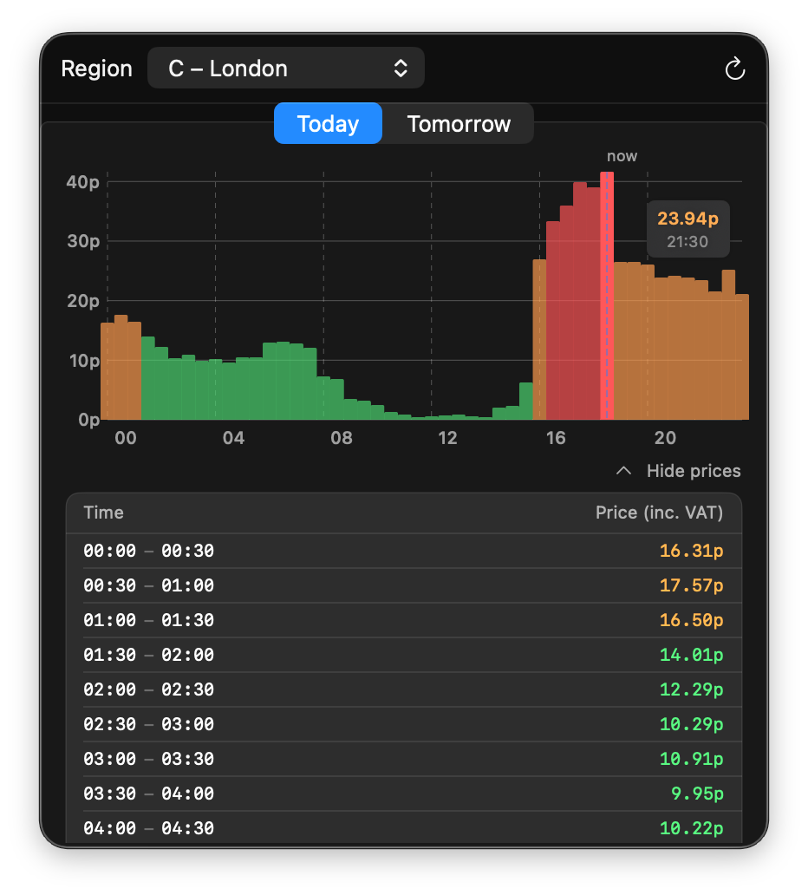

# Octopus Menubar

A macOS menubar app that shows [Octopus Energy Agile](https://octopus.energy/agile/) half-hourly electricity prices as a bar chart.

## Features

- Bar chart of today's and tomorrow's 30-minute price slots
- Colour-coded by price: green (<15p), amber (<30p), red (≥30p), blue (negative)
- Current time slot highlighted with a "now" marker
- Hover tooltips showing the price and time for each bar
- Expandable price table listing all 48 slots
- Region picker for all 14 UK DNO regions (A–P)

## Requirements

- macOS 13 (Ventura) or later
- An Octopus Energy Agile tariff (prices are fetched from the public API — no account or API key needed)

## Setup

1. Open `octopus-menubar/OctopusMenubar.xcodeproj` in Xcode
2. Set your team in Signing & Capabilities
3. Build and run (⌘R)

The app runs as a menubar-only process (no Dock icon). Click the ⚡ bolt icon to open the price panel.

## Data

Prices are fetched from the [Octopus Energy API](https://developer.octopus.energy/guides/rest/api-endpoints/#agile-prices) for the `AGILE-24-10-01` product. Tomorrow's prices are typically published around 4pm each day.
